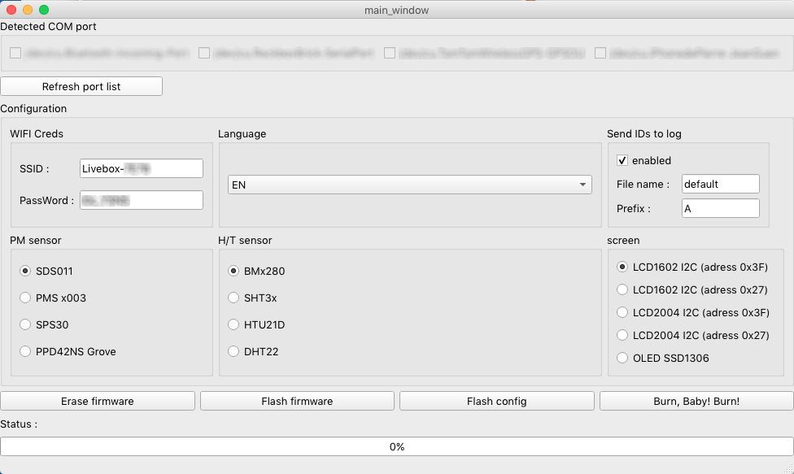

# Sensor.Community bulk flashing tool

THIS FLASHER IS MADE FOR ADVANCED USERS AND FOR SPECIAL PURPOSE. DON'T USE IT WITHOUT CONTACT SOMEONE AT SENSOR.COMMUNITY!


## Modified flasher to burn flash and test multiple boards.

spiffsgen.py added and kindly modified by @DeeKey
developed by [La Petite Fabrique de L'Isle d'Abeau](https://fr-fr.facebook.com/idapfab/) for the [Respire](https://www.respire-asso.org/) project in Paris, France



config.json example for reference:

```json{"SOFTWARE_VERSION":"NRZ-2020-133","current_lang":"FR","wlanssid":"Livebox-7E78","wlanpwd":"i0c_YSNS","www_username":"admin","www_password":"","fs_ssid":"airRohr-2509507","fs_pwd":"","www_basicauth_enabled":false,"dht_read":false,"htu21d_read":false,"ppd_read":false,"sds_read":false,"pms_read":true,"hpm_read":false,"npm_read":false,"sps30_read":false,"bmp_read":false,"bmx280_read":true,"sht3x_read":false,"ds18b20_read":false,"dnms_read":false,"dnms_correction":"0.0","temp_correction":"0.0","gps_read":false,"send2dusti":true,"ssl_dusti":false,"send2madavi":true,"ssl_madavi":false,"send2sensemap":false,"send2fsapp":false,"send2aircms":false,"send2csv":false,"auto_update":true,"use_beta":false,"has_display":false,"has_sh1106":false,"has_flipped_display":false,"has_lcd1602":false,"has_lcd1602_27":true,"has_lcd2004":false,"has_lcd2004_27":false,"display_wifi_info":true,"display_device_info":true,"debug":3,"sending_intervall_ms":145000,"time_for_wifi_config":600000,"senseboxid":"","send2custom":false,"host_custom":"192.168.234.1","url_custom":"/data.php","port_custom":80,"user_custom":"","pwd_custom":"","ssl_custom":false,"send2influx":false,"host_influx":"influx.server","url_influx":"/write?db=sensorcommunity","port_influx":8086,"user_influx":"","pwd_influx":"","measurement_name_influx":"feinstaub","ssl_influx":false}
```

## Drivers

You need drivers for the USB2serial chipset:

* Drivers for NodeMCU v3 (CH340)

    * [Windows](http://www.wch.cn/downloads/file/5.html) (Windows 10 should be able to automatically download these; [2018/09/04 v3.4 mirror](https://d.inf.re/luftdaten/CH341SER.ZIP))
    * [MacOS](http://www.wch.cn/downloads/file/178.html) ([2018/09/04 v1.4 mirror](https://d.inf.re/luftdaten/CH341SER_MAC.ZIP))

* Drivers for NodeMCU v2 ([CP2102](https://www.silabs.com/products/development-tools/software/usb-to-uart-bridge-vcp-drivers))

    * [Windows 10](https://www.silabs.com/documents/public/software/CP210x_Universal_Windows_Driver.zip), [Windows 7/8/8.1](https://www.silabs.com/documents/public/software/CP210x_Windows_Drivers.zip) (Windows 10 should be able to automatically download these)
    * [MacOS](https://www.silabs.com/documents/public/software/Mac_OSX_VCP_Driver.zip)

On Linux you should not need drivers, as they are usually already there, but you need to check that you as user have the permission to use the serial devices (otherwise you likely see an error like *serial.serialutil.SerialException: [Errno 13] could not open port /dev/ttyUSB0: [Errno 13] Permission denied: '/dev/ttyUSB0'*). 

* Debian/Ubuntu: add your user to the group `dialout` with `sudo usermod -a -G dialout ${USER}` (you may need to restart the desktop to apply your new group settings).

## Using the software

For now, the software has to be used with Python3. 
Go to the folder in the terminal window and type:

`python3 custom_flasher.py`

To flash devices:

1.If you use an USB hub to flash multiple boards at once, select the right COM ports
2. Type your WiFi credentials if you want to test the new stations on your netework
3. Choose the language
4. Configure the right sensors

You can flash the firmware, flash the configuration or both.

The custom flasher download the last bin of the Sensor.Community firmware.

If you want to delete/reset all settings on the device (e.g. the Wifi credentials) you can use the `Erase Flash` button.

All the IDs can be sent to a csv file (created in the very folder of the software) which can then be forwarded to the local community for registration and supervizing purposes.

### Further steps

If you have flashed your WiFi credentials, the stations connect directly to you network. You can then check the values they measure through your router (DHCP client list)


## Building the software

### Windows

Currently Windows builds require *Python 3.6* installed system-wide and added to `%PATH%`.

Install [pyinstaller](https://www.pyinstaller.org/)

`pyinstaller --onefile --windowed --add-data="main_window.ui;." custom_flasher.py`

`pyinstaller --onefile --windowed --add-data="C:\Users\gabri\Desktop\custom_flasher\custom_flasher\main_window.ui;." custom_flasher.py`


## To do list

auto update port list
prevent bad usages
try compressing spiffs, or reducing size
serial monitor
search sensor tab